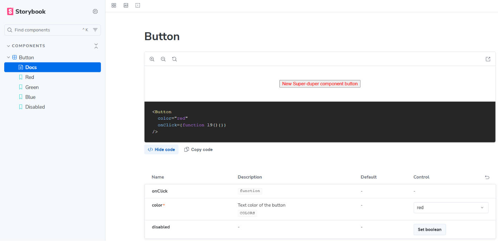

# Step 5 — Storybook Setup

## Overview

Storybook is a **development environment for UI components**. It runs a local server where you can view, interact with, and document each component in isolation — completely outside of any application. For a component library, it serves as both a live playground and an automatically generated catalogue.

---

## Installation

Run the Storybook initializer inside your project:

```bash
npx storybook@latest init
```

Storybook detects that you're using Vite and React and configures itself accordingly. It will:

- Install the required dependencies
- Create a `.storybook/` folder with `main.ts` and `preview.ts`
- Add a `storybook` script to `package.json`

After init, start Storybook:

```bash
npm run storybook
```

---

## What Gets Created

```
.storybook/
├── main.ts      ← tells Storybook where to find stories and which addons to use
└── preview.ts   ← global settings applied to every story
```

### `.storybook/main.ts`

```ts
import type { StorybookConfig } from '@storybook/react-vite';

const config: StorybookConfig = {
  stories: [
    "../src/**/*.mdx",
    "../src/**/*.stories.@(js|jsx|mjs|ts|tsx)"
  ],
  addons: [
    "@storybook/addon-docs",
  ],
  framework: "@storybook/react-vite"
};

export default config;
```

The `stories` glob tells Storybook to scan your entire `src/` tree for any file matching `*.stories.*`. This means every component's stories file is picked up automatically — you never need to register them manually.

### `.storybook/preview.ts`

Global configuration applied to every story — things like decorators, global parameters, and control matchers. You don't need to touch this to get started.

---

## Writing Stories — `Button.stories.tsx`

A stories file lives **next to the component it documents**:

```
src/components/Button/
├── Button.tsx
├── Button.stories.tsx  ← here
└── index.ts
```

Here's the full stories file for the Button:

```tsx
import type { Meta, StoryObj } from "@storybook/react-vite";
import { fn } from "storybook/test";
import Button, { COLORS } from "./Button";

const meta = {
  title: "Components/Button",
  component: Button,
  parameters: {
    layout: "centered",
  },
  tags: ["autodocs"],
  argTypes: {
    color: {
      control: "select",
      options: ["red", "green", "blue"],
      description: "Text color of the button",
    },
    disabled: { control: "boolean" },
    onClick: { action: "clicked" },
  },
  args: {
    onClick: fn(),
  },
} satisfies Meta<typeof Button>;

export default meta;
type Story = StoryObj<typeof meta>;

export const Red: Story = {
  args: {
    color: COLORS.RED,
  },
};

export const Green: Story = {
  args: {
    color: COLORS.GREEN,
  },
};

export const Blue: Story = {
  args: {
    color: COLORS.BLUE,
  },
};

export const Disabled: Story = {
  args: {
    color: COLORS.BLUE,
    disabled: true,
  },
};
```

---

## Stories File Structure Explained

### `meta` — the component descriptor

```ts
const meta = { ... } satisfies Meta<typeof Button>;
export default meta;
```

The default export is the **meta object** — it describes the component as a whole. Storybook reads this to build the sidebar entry and the docs page.

| Field | Purpose |
|---|---|
| `title` | Sidebar path. `"Components/Button"` nests Button under a "Components" group |
| `component` | The React component being documented |
| `parameters.layout` | How the story is positioned in the canvas (`"centered"`, `"fullscreen"`, `"padded"`) |
| `tags: ["autodocs"]` | Tells Storybook to auto-generate a Docs page from your stories and `argTypes` |
| `argTypes` | Defines how each prop appears in the Controls panel — type, control widget, description |
| `args` | Default prop values shared across all stories in this file |

---

### `argTypes` — controlling the props panel

```ts
argTypes: {
  color: {
    control: "select",
    options: ["red", "green", "blue"],
    description: "Text color of the button",
  },
  disabled: { control: "boolean" },
  onClick: { action: "clicked" },
},
```

`argTypes` maps each prop to a **UI control** in Storybook's Controls panel. Common control types:

| Control type | Rendered as |
|---|---|
| `"select"` | Dropdown with the provided `options` |
| `"boolean"` | Toggle switch |
| `"text"` | Text input |
| `"number"` | Number input |
| `"color"` | Color picker |
| `{ action: "..." }` | Logs calls to the Actions panel instead of rendering a control |

---

### Individual stories — `StoryObj`

```ts
type Story = StoryObj<typeof meta>;

export const Red: Story = {
  args: {
    color: COLORS.RED,
  },
};
```

Each **named export** is a story — a single rendered state of the component. The `args` object sets the props for that specific story. Storybook merges these with the `args` defined in `meta`, so you only override what differs.

The story name in the sidebar comes from the export name: `Red`, `Green`, `Blue`, `Disabled`.

---

## What It Looks Like



The left sidebar shows the component tree (`Components > Button`) with each story listed below it. The main panel shows:

- A live render of the component
- The component's JSX source
- The **Controls** panel — interactive prop controls generated from `argTypes`
- The auto-generated **Docs** page (when `tags: ["autodocs"]` is set) with prop descriptions and all stories rendered inline

---

## Summary

| Concept | What it does |
|---|---|
| `meta` default export | Describes the component — title, controls, shared args |
| `title` | Controls sidebar grouping and path |
| `tags: ["autodocs"]` | Enables auto-generated documentation page |
| `argTypes` | Maps props to interactive UI controls |
| `args` | Default prop values for the component or a specific story |
| Named story exports | Each export = one rendered state shown in the sidebar |
